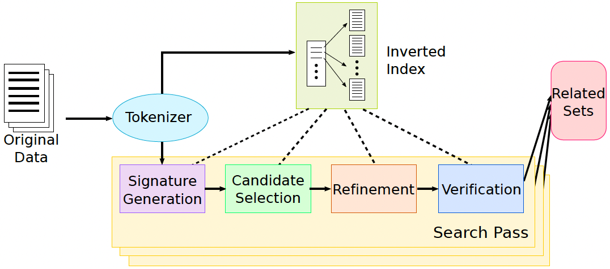

# 🦋 LSDIPro SS2025

## 📄 [SilkMoth: An Efficient Method for Finding Related Sets](https://doi.org/10.14778/3115404.3115413)

A project inspired by the SilkMoth paper, exploring efficient techniques for related set discovery.

---

### 👥 Team Members
- **Andreas Wilms**
- **Sarra Daknou**
- **Amina Iqbal**
- **Jakob Berschneider**

---

### 📘 Project Documentation

#### 🔁 Core Pipeline Steps

*Figure 1. SILKMOTH pipeline framework. Source: Deng et al., "SILKMOTH: An Efficient Method for Finding Related Sets with Maximum Matching Constraints", VLDB 2017.  
Licensed under CC BY-NC-ND 4.0.*
#### 1. Tokenization
Each element in every set is tokenized based on the selected similarity function:
- **Jaccard Similarity**: Elements are split into whitespace-delimited tokens.
- **Edit Similarity**: Elements are split into overlapping `q`-grams (e.g., 3-grams).

#### 2. Inverted Index Construction
An **inverted index** is built from the reference set `R` to map each token to a list of `(set, element)` pairs in which it occurs. This allows fast lookup of candidate sets that share tokens with a query.

#### 3. Signature Generation
A **signature** is a subset of tokens selected from each set such that:
- Any related set must share at least one signature token.
- Signature size is minimized to reduce candidate space.

**Signature selection heuristics** (e.g., cost/value greedy ranking) are used to approximate the optimal valid signature, which is NP-complete to compute exactly.

#### 4. Candidate Selection
For each set `R`, we retrieve from the inverted index all sets `S` that share at least one token with `R`’s signature. These become the **candidate sets** for further evaluation.

#### 5. Refinement Filters
Two filters reduce false positives among the candidates:

- **Check Filter**: Uses an upper bound on similarity to eliminate sets that cannot meet the threshold.
- **Nearest Neighbor Filter**: Approximates the maximum matching score using the nearest neighbor similarity for each element in `R`.

#### 6. Verification via Maximum Matching
For the remaining candidates, we compute the **maximum weighted bipartite matching** between elements of `R` and `S`, using the chosen similarity function as edge weights.

Only sets whose matching score meets or exceeds a threshold `δ` are considered **related**.

---

#### 🧪 Modes of Operation
- **Discovery Mode**: Compare all pairs of sets to find all related set pairs. 
**Use Case**: When you want to check which sets (e.g., columns in a database) are related to a specific reference set.
- **Search Mode**: Given a reference set, find all sets related to it. 
**Use Case**: When you want to find all related set pairs in a dataset, for tasks like schema matching or entity deduplication.
---

#### 📐 Supported Similarity Functions
- **Jaccard Similarity**
- **Edit Similarity** (Levenshtein-based)
- Optional **minimum similarity threshold** `α` can be enforced on element comparisons.

---

### Installing from source

1. Run `pip install src/` to install
2. (optional) Run `python -m unittest discover -s src/silkmoth/test -p "*.py"` to execute the unit tests

### Running the experiment
1. Run `python experiments/run.py` to execute the experiment