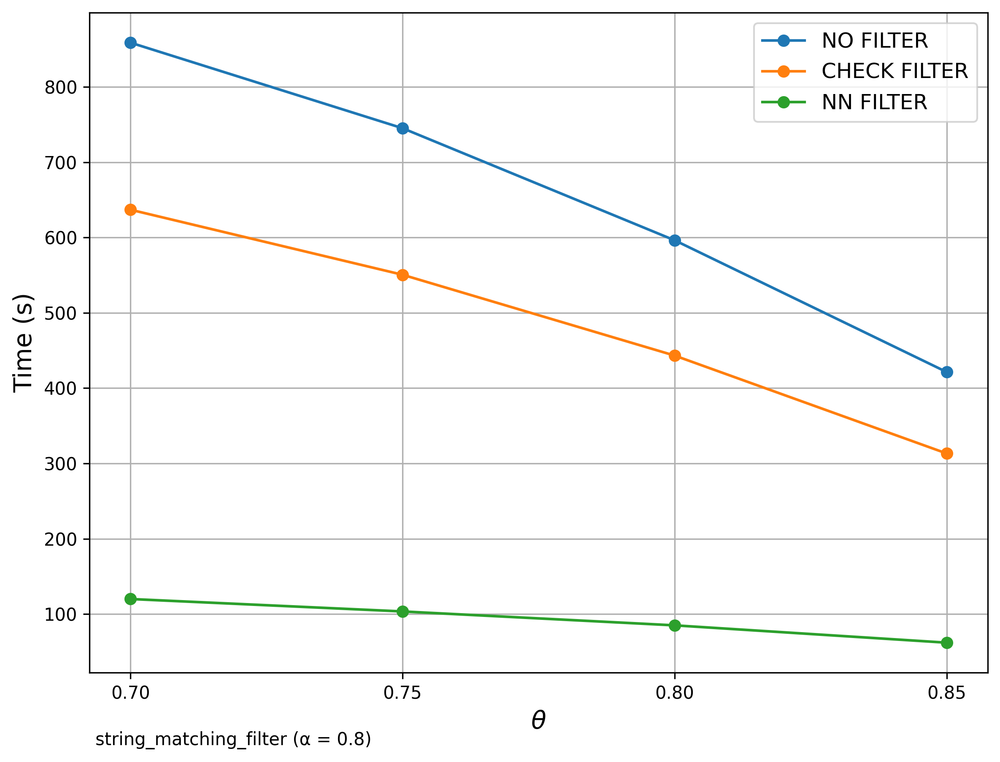

### 🧪 Running the Experiments

This project includes multiple experiments to evaluate the performance and accuracy of our Python implementation of **SilkMoth**.

---

#### 📊 1. Experiment Types

You can replicate and customize the following types of experiments using different configurations (e.g., filters, signature strategies, reduction techniques):

- **String Matching (DBLP Publication Titles)**
- **Schema Matching (WebTables)**
- **Inclusion Dependency Discovery (WebTable Columns)**

Exact descriptions can be found in the official paper.

---

#### 📦 2. WebSchema Inclusion Dependency Setup

To run the **WebSchema + Inclusion Dependency** experiments:

1. Download the pre-extracted dataset from  
   [📥 this link](https://tubcloud.tu-berlin.de/s/D4ngEfdn3cJ3pxF).
2. Place the `.json` files in the `data/webtables/` directory  
   *(create the folder if it does not exist)*.

---

#### 🚀 3. Running the Experiments

To execute the core experiments from the paper:

```bash
python run.py
```

### 📈 4. Results Overview

We compared our results with those presented in the original SilkMoth paper.  
Although exact reproduction is not possible due to language differences (Python vs C++) and dataset variations, overall **performance trends align well**.

All the results can be found in the folder  `results`. 

The **left** diagrams are from the paper and the **right** are ours.

> 💡 *Recent performance enhancements leverage `scipy`’s C-accelerated matching, replacing the original `networkx`-based approach.  
> Unless otherwise specified, the diagrams shown are generated using the `networkx` implementation.*


---

### 🔍 Inclusion Dependency

> **Goal**: Check if each reference set is contained within source sets.

**Filter Comparison**  
<p align="center">
  
  
</p>

**Signature Comparison**  
<p align="center">
  
  
</p>

**Reduction Comparison**  
<p align="center">
  
  
</p>

**Scalability**  
<p align="center">
  
  
</p>

---

### 🔍 Schema Matching (WebTables)

> **Goal**: Detect related set pairs within a single source set.

**Filter Comparison**  
<p align="center">
  
  
</p>

**Signature Comparison**  
<p align="center">
  
  
</p>

**Scalability**  
<p align="center">
  
  
</p>

---

### 🔍 String Matching (DBLP Publication Titles)
>**Goal:** Detect related titles within the dataset using the extended SilkMoth pipeline
based on **edit similarity** and **q-gram** tokenization.
> SciPy was used here.

**Filter Comparison**  
<p align="center">
  
  
</p>

**Signature Comparison**  
<p align="center">
  
  
</p>

**Scalability**  
<p align="center">
  
  
</p>
---

### 🔍 Additional: Inclusion Dependency SilkMoth Filter compared with no SilkMoth

> In this analysis, we focus exclusively on SilkMoth. But how does it compare to a 
> brute-force approach that skips the SilkMoth pipeline entirely? The graph below 
> shows the Filter run alongside the brute-force bipartite matching method without any 
> optimization pipeline. The results clearly demonstrate a dramatic improvement 
> in runtime efficiency when using SilkMoth.


---

### 🔍 Additional: Schema Matching with GitHub WebTables

> Similar to Schema Matching, this experiment uses a GitHub WebTable as a fixed reference set and matches it against other sets. The goal is to evaluate SilkMoth’s performance across different domains.
**Left:** Matching with one reference set.
**Right:** Matching with WebTable Corpus and GitHub WebTable datasets.
The results show no significant difference, indicating consistent behavior across varying datasets.

<p align="center">
  
  
</p>
